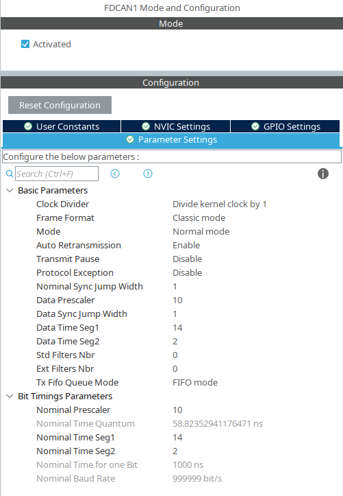
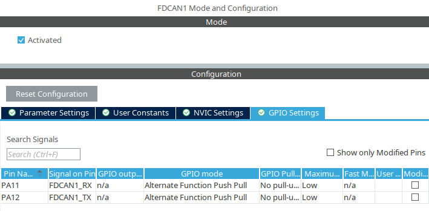
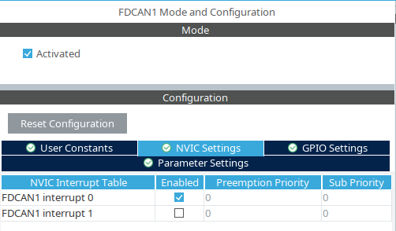
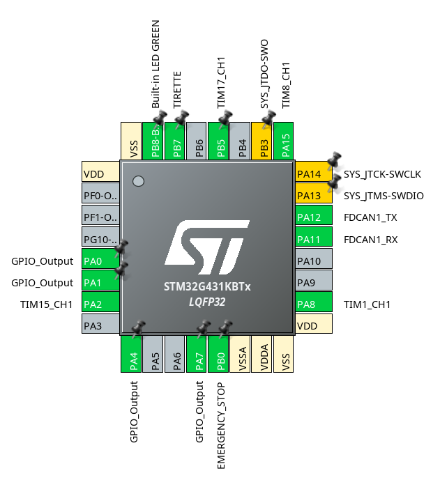

# Champi Libraries STM32

Ce repo centralise les librairies que l'on crée pour STM32, et que l'on est susceptible d'utiliser dans plusieurs projets STM.

## Utilisation

La marche à suivre pour utiliser les librairies dans un projet exécutable est la suivante.

1) Cloner le projet de libraries dans le workspace STM32CubeIDE.

2) Paramétrer le projet exécutable pour qu'il trouve les libraries. Pour cela, il faut suivre [ce guide](https://community.st.com/t5/stm32-mcus/how-to-add-external-libraries-in-stm32cubeide/ta-p/628619#:~:text=After%20creating%20a%20project%20for,%3E%20MCU%20GCC%20Linker%20%3E%20Libraries).
⚠️ Attention ! Le guide est pour un projet C (`main.c`). Pour un projet C++, il faut ajouter le chemin de la librairie dans `MCU G++ Compiler -> Include path`s au lieu de `MCU GCC Compiler -> Include paths`.

3) Dans le projet exécutable, paramétrer le phériphérique FDCAN pour que la librairie fonctionne correctement.

